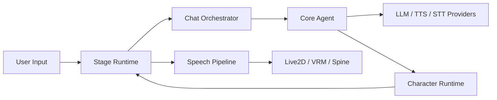

<picture>
  <source
    srcset="./docs/content/public/banner-dark-1280x640.avif"
    media="(prefers-color-scheme: dark)"
  />
  <source
    srcset="./docs/content/public/banner-light-1280x640.avif"
    media="(prefers-color-scheme: light), (prefers-color-scheme: no-preference)"
  />
  
</picture>

<h1 align="center">Project AIRI</h1>

<p align="center">
  A cross-platform AI character runtime for browser, desktop, and mobile.
</p>

<p align="center">
  <a href="https://airi.moeru.ai">Website</a> ·
  <a href="https://github.com/moeru-ai/airi/blob/main/docs/README.zh-CN.md">简体中文</a> ·
  <a href="https://github.com/moeru-ai/airi/blob/main/docs/README.ja-JP.md">日本語</a> ·
  <a href="https://github.com/moeru-ai/airi/blob/main/docs/README.ru-RU.md">Русский</a> ·
  <a href="https://github.com/moeru-ai/airi/blob/main/docs/README.vi.md">Tiếng Việt</a> ·
  <a href="https://github.com/moeru-ai/airi/blob/main/docs/README.fr.md">Français</a> ·
  <a href="https://github.com/moeru-ai/airi/blob/main/docs/README.ko-KR.md">한국어</a>
</p>

<p align="center">
  <a href="https://github.com/moeru-ai/airi/blob/main/LICENSE"></a>
  <a href="https://discord.gg/TgQ3Cu2F7A"></a>
  <a href="https://x.com/proj_airi"></a>
  <a href="https://trendshift.io/repositories/14636" target="_blank"></a>
</p>

## What AIRI Is

AIRI is not just a chat UI. It is a **character runtime**:

- a brain that can chat, reason, and use tools
- a body that can render Live2D, VRM, and Spine characters
- ears and mouth for speech input/output
- a stage that can feel like a living presence instead of a plain message window

The project is built as a monorepo so the same runtime ideas can ship across:

- `stage-web`: browser / PWA
- `stage-tamagotchi`: desktop Electron app
- `stage-pocket`: mobile shell

## Visual Overview

<p align="center">
  
  
</p>

<p align="center">
  
  
</p>

## Why This Repo Matters

Most AI companion projects stop at:

- chat
- character cards
- roleplay
- a single app surface

AIRI pushes toward a fuller runtime:

- multi-surface character embodiment
- tool use and game-playing hooks
- speech pipelines
- local and remote provider flexibility
- stage-aware rendering and pacing
- a shared runtime core across browser, desktop, and mobile

That is the difference between “an assistant with a face” and “a persistent digital character.”

## Current Direction

The repo is actively evolving toward a stronger **character presence** model.

Recent architecture work in this repo now treats AIRI as:

- the canonical shell and runtime owner
- the stage and presence renderer
- the timeline and character-state owner

This direction matters because AIRI is increasingly optimized around:

- presence cue
- residue
- delayed reply
- intentional silence
- continuity across returns

Instead of only optimizing for better text generation.

## Project Structure

### Apps

- `apps/stage-web`: web app and PWA surface
- `apps/stage-tamagotchi`: desktop Electron app
- `apps/stage-pocket`: mobile app shell
- `apps/server`: backend and server-side services

### Core shared packages

- `packages/stage-ui`: shared stage business logic, stores, components
- `packages/stage-shared`: shared runtime helpers and contracts
- `packages/ui`: lower-level reusable UI primitives
- `packages/core-agent`: chat/runtime orchestration core
- `packages/pipelines-audio`: audio and speech pipeline infrastructure
- `packages/i18n`: translations and locale resources

### Rendering / model packages

- `packages/stage-ui-live2d`
- `packages/stage-ui-three`
- `packages/stage-ui-spine`
- `packages/model-driver-lipsync`

## Architecture Snapshot



## Supported Surfaces

### Browser

- PWA support
- stage runtime in browser
- provider-driven chat and speech flows

### Desktop

- Electron shell
- tray integration
- richer local integration paths

### Mobile

- Capacitor-based shell
- shared stage UI and stores

## Capabilities

### Brain

- chat with multiple providers
- tool calling
- game / environment integrations
- context-aware runtime orchestration

### Body

- Live2D rendering
- VRM rendering
- Spine rendering
- animations, lip sync, motion hooks

### Voice

- speech input pipelines
- speech output pipelines
- multiple provider backends

### Memory / state

- browser-compatible local data paths
- cloud/server sync layers
- work-in-progress continuity and character state work

## Screens and Downloads

<p align="center">
  <a href="https://github.com/moeru-ai/airi/releases/latest">
    <picture>
      <source
        width="33%"
        srcset="./docs/content/public/assets/download-buttons/download-buttons.windows.dark.en-US.avif"
        media="(prefers-color-scheme: dark)"
      />
      <source
        width="33%"
        srcset="./docs/content/public/assets/download-buttons/download-buttons.windows.light.en-US.avif"
        media="(prefers-color-scheme: light), (prefers-color-scheme: no-preference)"
      />
      
    </picture>
  </a>
  <a href="https://github.com/moeru-ai/airi/releases/latest">
    <picture>
      <source
        width="33%"
        srcset="./docs/content/public/assets/download-buttons/download-buttons.macos.dark.en-US.avif"
        media="(prefers-color-scheme: dark)"
      />
      <source
        width="33%"
        srcset="./docs/content/public/assets/download-buttons/download-buttons.macos.light.en-US.avif"
        media="(prefers-color-scheme: light), (prefers-color-scheme: no-preference)"
      />
      
    </picture>
  </a>
  <a href="https://github.com/moeru-ai/airi/releases/latest">
    <picture>
      <source
        width="33%"
        srcset="./docs/content/public/assets/download-buttons/download-buttons.linux.dark.en-US.avif"
        media="(prefers-color-scheme: dark)"
      />
      <source
        width="33%"
        srcset="./docs/content/public/assets/download-buttons/download-buttons.linux.light.en-US.avif"
        media="(prefers-color-scheme: light), (prefers-color-scheme: no-preference)"
      />
      
    </picture>
  </a>
</p>

<p align="center">
  <a href="https://airi.moeru.ai">
    <picture>
      <source
        width="33%"
        srcset="./docs/content/public/assets/QR%20code%20button/section.cards.qrcode.dark.en-US.png"
        media="(prefers-color-scheme: dark)"
      />
      <source
        width="33%"
        srcset="./docs/content/public/assets/QR%20code%20button/section.cards.qrcode.light.en-US.png"
        media="(prefers-color-scheme: light), (prefers-color-scheme: no-preference)"
      />
      
    </picture>
  </a>
  <a href="https://airi.moeru.ai">
    <picture>
      <source
        width="33%"
        srcset="./docs/content/public/assets/download-buttons/download-buttons.mobile.dark.en-US.avif"
        media="(prefers-color-scheme: dark)"
      />
      <source
        width="33%"
        srcset="./docs/content/public/assets/download-buttons/download-buttons.mobile.light.en-US.avif"
        media="(prefers-color-scheme: light), (prefers-color-scheme: no-preference)"
      />
      
    </picture>
  </a>
  <a href="https://airi.moeru.ai">
    <picture>
      <source
        width="33%"
        srcset="./docs/content/public/assets/download-buttons/download-buttons.browser.dark.en-US.png"
        media="(prefers-color-scheme: dark)"
      />
      <source
        width="33%"
        srcset="./docs/content/public/assets/download-buttons/download-buttons.browser.light.en-US.png"
        media="(prefers-color-scheme: light), (prefers-color-scheme: no-preference)"
      />
      
    </picture>
  </a>
</p>

## Quick Start

### Requirements

- Node.js
- pnpm
- modern browser or desktop environment depending on your target

### Install

```sh
pnpm install
```

### Run the web stage

```sh
pnpm dev
```

### Run the desktop app

```sh
pnpm dev:tamagotchi
```

### Run the docs site

```sh
pnpm dev:docs
```

## Useful Commands

```sh
pnpm dev
pnpm dev:tamagotchi
pnpm dev:pocket:ios
pnpm build
pnpm test:run
pnpm lint
pnpm typecheck
```

## Provider Support

AIRI supports a broad provider surface through `xsai` and related packages, including:

- OpenAI
- Anthropic
- DeepSeek
- Google Gemini
- Groq
- Mistral
- Ollama
- OpenRouter
- Together
- Fireworks
- Cloudflare Workers AI
- and many more already wired in `packages/stage-ui/src/libs/providers/providers`

## Related Projects

- [`unspeech`](https://github.com/moeru-ai/unspeech): unified speech proxy / endpoint layer
- [`@proj-airi/drizzle-duckdb-wasm`](https://github.com/moeru-ai/airi/tree/main/packages/drizzle-duckdb-wasm/README.md)
- [`@proj-airi/duckdb-wasm`](https://github.com/moeru-ai/airi/tree/main/packages/duckdb-wasm/README.md)
- [AIRI Factorio](https://github.com/moeru-ai/airi-factorio)
- [MCP Launcher](https://github.com/moeru-ai/mcp-launcher)
- [Awesome AI VTuber](https://github.com/proj-airi/awesome-ai-vtuber)

## Community

- Discord: <https://discord.gg/TgQ3Cu2F7A>
- X: <https://x.com/proj_airi>
- Telegram: <https://t.me/+7M_ZKO3zUHFlOThh>
- WeChat: [wechat.md](./docs/wechat.md)

## Notes

> [!WARNING]
> This project does **not** have an official token or cryptocurrency.

> [!TIP]
> Translation contributions are welcome on [Crowdin](https://crowdin.com/project/proj-airi).

> [!NOTE]
> AIRI is an active monorepo. If you are contributing to runtime, rendering, speech, infra, design, or character systems, read [AGENTS.md](./AGENTS.md) and the docs under `docs/` before making broad changes.

## Supporters

<p align="center">
  
</p>
