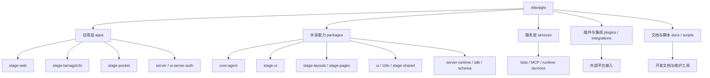
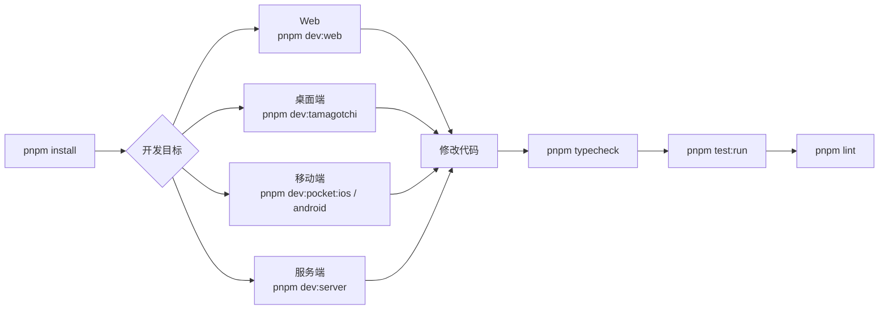
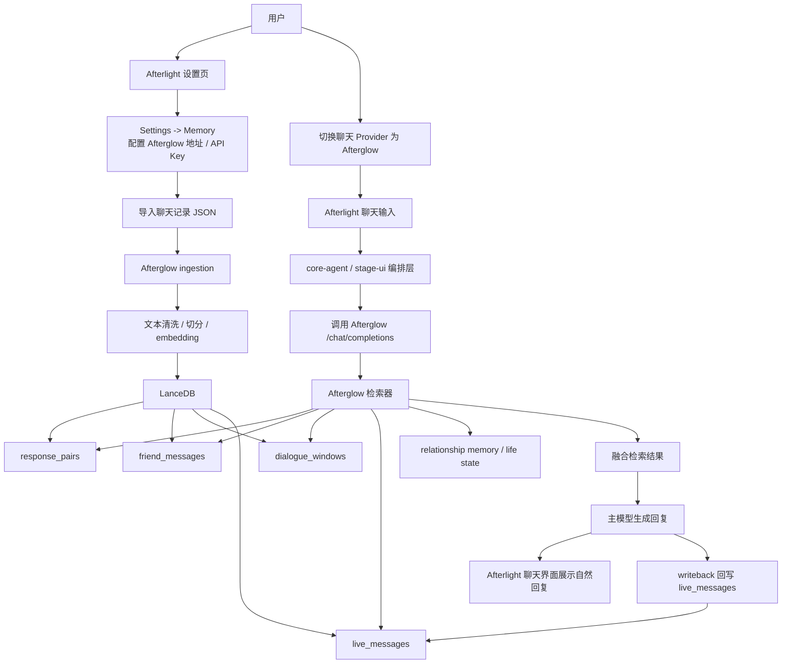
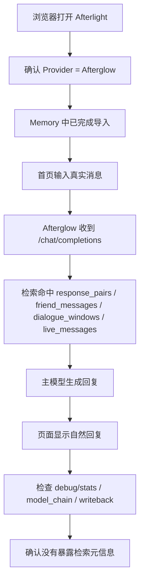

# Afterlight

这是一个用于构建和运行 AIRI 的多应用 monorepo。AIRI 是一个由大语言模型驱动的虚拟角色系统，覆盖 Web、桌面端、移动端，以及配套的共享运行时、UI 组件、插件和服务。

当前这个仓库主要承担两类职责：

- AIRI 主产品工作区
- 外部系统接入层，例如 Afterglow、模型提供商、插件和服务运行时

## 总览流程图



## 仓库内容

### 应用层

- `apps/stage-web`
  AIRI 主 Web 应用，基于 Vue 3、Vite、Pinia、UnoCSS。
- `apps/stage-tamagotchi`
  AIRI 桌面端，基于 Electron。
- `apps/stage-pocket`
  AIRI 移动端，基于 Capacitor。
- `apps/server`
  AIRI 服务端应用入口。
- `apps/ui-server-auth`
  服务端认证相关 UI。
- `apps/component-calling`
  实时音频 / component-calling 相关实验应用。

### 共享包

- `packages/core-agent`
  聊天编排核心运行时。
- `packages/core-character`
  角色行为与角色管线编排核心。
- `packages/stage-ui`
  AIRI 共享 UI、状态管理、Provider 接线、聊天流程和场景组件。
- `packages/stage-layouts`
  共享布局层。
- `packages/stage-pages`
  共享页面层。
- `packages/stage-shared`
  跨端共享协议、工具和辅助逻辑。
- `packages/ui`
  低层可复用 UI 基础组件。
- `packages/i18n`
  国际化和翻译资源。
- `packages/server-runtime`、`packages/server-sdk`、`packages/server-shared`、`packages/server-schema`
  服务端运行时和前后端共享协议。
- `packages/stage-ui-live2d`、`packages/stage-ui-spine`、`packages/stage-ui-three`
  不同角色渲染层的场景组件和运行时支持。

### 服务与集成

- `services/*`
  AIRI 相关长期运行服务，例如机器人和 MCP 服务。
- `plugins/*`
  AIRI 插件包。
- `integrations/*`
  外部系统集成代码。

### 文档与工具

- `docs`
  项目文档与 AI 上下文文档。
- `scripts`
  仓库维护脚本和开发辅助脚本。
- `turbo.json`
  工作区任务编排配置。
- `vitest.config.ts`
  根测试配置。

## 环境要求

- Node.js `24+`
- `pnpm@10.33.0`
- 已启用 Corepack

推荐初始化方式：

```bash
corepack enable
corepack prepare pnpm@10.33.0 --activate
pnpm install
```

## 常用命令

### 开发流程图



### 开发

启动 Web 应用：

```bash
pnpm dev:web
```

启动桌面端：

```bash
pnpm dev:tamagotchi
```

启动移动端开发流程：

```bash
pnpm dev:pocket:ios
pnpm dev:pocket:android
```

并行启动所有应用开发任务：

```bash
pnpm dev:apps
```

### 构建

构建主要应用和包：

```bash
pnpm build
```

只构建 Web：

```bash
pnpm build:web
```

只构建桌面端：

```bash
pnpm build:tamagotchi
```

### 质量检查

运行类型检查：

```bash
pnpm typecheck
```

运行测试：

```bash
pnpm test:run
```

运行 lint：

```bash
pnpm lint
```

自动修复 lint / 格式问题：

```bash
pnpm lint:fix
```

## Afterglow 集成

AIRI 目前支持将 Afterglow 作为外部记忆与连续性后端来使用。

当前接入方式是：

- AIRI 负责产品外壳、聊天 UI、设置页、场景运行时和整体编排
- Afterglow 负责聊天记录导入、向量检索、关系连续性和基于记忆的回复生成

### Afterglow 接入流程图



### 真实验收流程图



### AIRI 侧对 Afterglow 的要求

至少需要满足：

- 可访问的 Afterglow 服务地址
- AIRI 可调用的 API Key
- 可用的聊天接口
- 如果你希望记忆参与回复，还需要已导入的聊天数据

### 在 AIRI 中的配置方式

1. 启动外部 Afterglow 后端。
2. 打开 AIRI 的 `设置 -> Memory`。
3. 配置：
   - Afterglow 服务地址
   - Afterglow API Key
4. 在 Memory 页面导入支持的训练 / 聊天记录 JSON。
5. 在 Provider / Consciousness 相关设置中把当前聊天 Provider 切换为 `Afterglow`。

### 说明

- Afterglow 在这个仓库里被视为外部服务，不是仓库内置后端。
- 本地密钥和敏感配置必须保存在本地环境或本地配置文件里，不能提交到仓库。
- 如果导入后记忆计数没有变化，优先检查外部 Afterglow 后端。
- 如果回复没有体现记忆效果，优先确认：
  - AIRI 当前是否真的切到了 `Afterglow` Provider
  - 外部 Afterglow 后端是否能在运行时读到导入后的向量数据

## 工作区约定

- 优先使用 `pnpm` workspace filter 跑定向任务。
- 可复用共享逻辑应尽量放在 `packages/`，而不是散落在各个应用里重复实现。
- AIRI 主要产品逻辑通常集中在：
  - `packages/stage-ui`
  - `packages/stage-layouts`
  - `packages/stage-pages`
- 根目录 `README.md` 只是总览。具体改动某个子系统时，应该继续阅读对应 app/package 下的本地文档。

## 测试与验证

这个仓库大量使用 Vitest。实际开发时建议：

- 改动哪个模块，就优先跑对应模块的定向测试
- 完成任务后至少跑 typecheck 和 lint
- 遇到浏览器 / UI 问题时，除了单元测试，也应做真实浏览器验证

示例：

```bash
pnpm exec vitest run packages/core-agent/src/runtime/llm-service.test.ts
pnpm -F @proj-airi/stage-ui typecheck
pnpm -F @proj-airi/stage-layouts typecheck
```

## 安全说明

- 不要提交 API Key、本地 Token、个人聊天记录或其他敏感数据。
- 导入的聊天记录和外部记忆后端通常包含高度敏感的个人信息。
- 即使你已经把密钥从当前文件删除，Git 历史中仍可能保留它。

## 许可证

除非某个子项目另有说明，本仓库采用 MIT License。详见 [LICENSE](/Users/pangxiao/Tools/Afterlight/LICENSE)。
